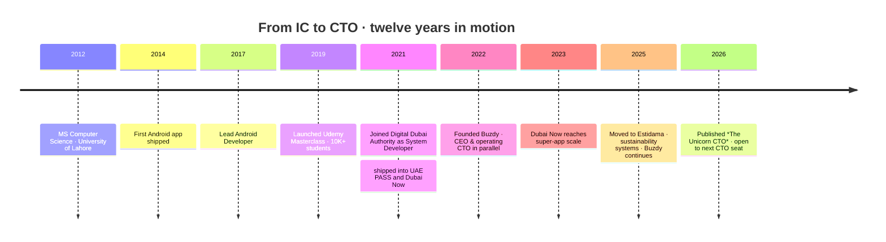

<!--
  Zia Shahid — GitHub Profile README
  Positioning: CTO · Fractional CTO · Founder-Operator
  Hand-crafted. Built to be read by founders, recruiters, investors, and serious engineers.
-->

<div align="center">


<br/>

# Muhammad Zia Shahid

### CTO-minded engineering leader · Founder-operator · Mobile-first architect

<sub>**Dubai, UAE** &nbsp;·&nbsp; 12+ years &nbsp;·&nbsp; 5 live ventures &nbsp;·&nbsp; Author of [_The Unicorn CTO_](https://www.amazon.com/Unicorn-CTO-Fastest-route-developer-ebook/dp/B0994S3TF8)</sub>

<br/>

<a href="mailto:info@theappsfirm.com?subject=Intro%20call%20—%20from%20your%20GitHub"></a>

<sub>_for CTO roles · fractional · board · advisory_ &nbsp;·&nbsp; <a href="#-lets-talk">other channels ↓</a></sub>

</div>

<br/>

> **I build the engineering machine behind products:**
> strategy, architecture, hiring, delivery, security, infrastructure — and the hard calls in between.

---

## 🧭 Profile in One Page

| Area | Signal |
|---|---|
| **Current direction** | Open to **CTO · Fractional CTO · Founding CTO · Board / Advisory** |
| **Base** | Dubai, UAE &nbsp;·&nbsp; UTC+4 |
| **Background** | 12+ years across mobile engineering, government-scale systems, product leadership, and founder-led execution |
| **Leadership scope** | Led engineering teams of **15+** across ventures and prior roles |
| **Founder portfolio** | [Buzdy](https://buzdy.com) · [TheAppsFirm](https://theappsfirm.com) · [W3Quran](https://w3quran.com) · [Mr Oye](https://mroye.com) · [Molaqat](https://molaqat.com) |
| **Author** | _The Unicorn CTO_ — 35 chapters · ~95,000 words · Dec 2025 |
| **Operating style** | Hands-on when needed · strategic when it matters · accountable always |
| **Stack DNA** | Mobile-first (Kotlin · Flutter) · Python backend · AWS · own infra (Hetzner · Cloudflare) · AI-native (Claude Code · OpenAI CLI) |

---

## ✨ What Makes This Profile Different

> Most technical profiles show tools.
> This profile shows **judgment**.

I've worked across **three very different stages** of technology work — most engineers see one or two.

<table>
<tr>
<td width="33%" valign="top">

### 🏛️ &nbsp; Government Scale

Contributed to **national and city-scale digital platforms** in the UAE ecosystem.

**Focus:** reliability, security, identity, regulated flows, production discipline.

</td>
<td width="33%" valign="top">

### 🚀 &nbsp; Founder Scale

Built and operated **multiple ventures from idea to live product**.

**Focus:** speed, GTM, hiring, infrastructure, product-market learning.

</td>
<td width="33%" valign="top">

### 🧠 &nbsp; CTO Scale

Turned **technical decisions into business outcomes**.

**Focus:** roadmap, architecture, team design, risk, delivery, board-level communication.

</td>
</tr>
</table>

---

## 🧩 What I Do as a CTO

<table>
<tr>
<td width="50%" valign="top">

### 01 · Technical Direction

I translate messy business goals into technical priorities engineers can actually ship.

- Architecture direction
- Build vs buy decisions
- Delivery sequencing
- Platform choices
- Technical debt strategy

</td>
<td width="50%" valign="top">

### 02 · Engineering Organisation

I build the team that builds the product.

- Hiring plans · role clarity · levelling
- Performance management
- Team rituals · delivery ownership
- On-call · incident review

</td>
</tr>
<tr>
<td width="50%" valign="top">

### 03 · Product + Execution

I stay close to the customer, not only the code.

- MVP definition · launch planning
- Reliability tradeoffs
- Product analytics
- Fast iteration loops

</td>
<td width="50%" valign="top">

### 04 · Risk + Trust

I treat security, uptime, and compliance as product features.

- Authentication · payments · data protection
- Vendor risk · incident response
- Production ownership
- Stakeholder + board communication

</td>
</tr>
</table>

---

## 🏗️ Selected Systems & Products

<table>
<tr>
<td width="33%" align="center" valign="top">

<br/>


### UAE PASS

**National digital identity ecosystem**

`identity` · `security` · `mobile` · `regulated`

_Role: **System Developer**_
_Context: Digital Dubai Authority_

</td>
<td width="33%" align="center" valign="top">

<br/>


### Dubai Now

**City super-app for residents and services**

`mobile` · `payments` · `scale` · `service delivery`

_Role: **System Developer**_
_Context: Digital Dubai Authority_

</td>
<td width="33%" align="center" valign="top">

<br/>


### BotIM

**Calls, chat, money — one app**

`messaging` · `voip` · `AI translation` · `payments`

_Role: **Contributor**_
_Scope: Global product_

</td>
</tr>
</table>

---

## 🧪 The Operator Portfolio

> _Five live ventures. Capital-efficient by design — the agency funds the products, the products inform the book, the book opens the rooms._

| Venture | Category | What it proves |
|---|---|---|
| [**Buzdy**](https://buzdy.com) | Fintech · AI · mobile | I can build a product thesis, ship it, and iterate in public |
| [**TheAppsFirm**](https://theappsfirm.com) | Apps agency | I understand client delivery, cashflow, and practical execution |
| [**W3Quran**](https://w3quran.com) | Islamic / Quran tech | I build beyond trends when the mission matters |
| [**Mr Oye**](https://mroye.com) | AI browser extension | I work AI-native and ship productivity tools |
| [**Molaqat**](https://molaqat.com) | Meetings / GCC productivity | I understand region-specific product opportunities |

<br/>

### 💸 &nbsp; Founder's bet — Buzdy in depth

<table>
<tr>
<td width="25%" align="center" valign="middle">


</td>
<td width="75%" valign="top">

**A lead engine for banks** — real-time crypto signals + AI coin analysis that **self-qualifies users** as high-intent leads in the funnel.

```diff
+ Stack         Android · Flutter · Python · AI · AWS
+ Footprint     iOS · Android · Web
+ Status        Live · iterating · hiring quietly
+ Looking for   design partners (banks, fintechs) · advisors
```

<p>
  <a href="https://apps.apple.com/il/app/buzdy/id6758299754"></a>
  &nbsp;
  <a href="https://play.google.com/store/apps/details?id=com.buzdy.zia"></a>
  &nbsp;
  <a href="https://buzdy.com"></a>
</p>

</td>
</tr>
</table>

> _I do not only advise founders from the outside. I have sat in the founder seat, carried the delivery pressure, and made the uncomfortable calls._

---

## 🦄 The Unicorn CTO — I wrote the book

<div align="center">

<a href="https://www.amazon.com/Unicorn-CTO-Fastest-route-developer-ebook/dp/B0994S3TF8">
  
</a>

**35 chapters &nbsp;·&nbsp; ~95,000 words &nbsp;·&nbsp; published Dec 2025**

<p>
  <a href="https://www.amazon.com/Unicorn-CTO-Fastest-route-developer-ebook/dp/B0994S3TF8"></a>
  &nbsp;
  <a href="https://play.google.com/store/books?q=The+Unicorn+CTO+Zia+Shahid"></a>
  &nbsp;
  <a href="https://github.com/ziacto/unicorn-cto-daily"></a>
</p>

</div>

<br/>

> **A strong CTO is not a senior developer with a louder title.**
> A strong CTO protects the company from bad technical decisions, bad hiring systems, bad incentives, and fake velocity.

**Inside:** the mindset shift that trips up 90% of new leaders · office politics · managing the 12 types of problem employees · budget & P&L ownership · building & scaling teams · staying technical while leading.

---

## 📍 Career Path



---

## 🧠 My Operating Manual

<details open>
<summary><b>Principles I actually use</b></summary>
<br/>

- **Boring technology, bold outcomes.** I prefer stable tools and aggressive execution.
- **Architecture is a business decision.** Every technical choice creates cost, speed, risk, or leverage.
- **Security is not a checklist.** It is part of the product experience.
- **A team without ownership becomes a ticket factory.**
- **The best CTO is close enough to code to know reality, and far enough from code to see the business.**

</details>

<details>
<summary><b>How I make technical decisions</b></summary>
<br/>

For every major technical call, I ask:

1. **Is it safe?** Security, privacy, uptime, compliance.
2. **Is it kind?** UX, error states, support load, on-call sanity.
3. **Is it fast?** Delivery speed, feedback loop, performance.

If speed requires breaking safety or kindness, it's the wrong speed.

</details>

<details>
<summary><b>How I think about hiring</b></summary>
<br/>

- **Hire for slope, not only current level.**
- **Promote ownership, not noise.**
- **Don't confuse confidence with competence.**
- **Give clear standards before judging performance.**
- **Protect strong engineers from broken process.**

</details>

<details>
<summary><b>What I'm currently exploring</b></summary>
<br/>

- Compose Multiplatform — one codebase, every screen
- LLM agents inside engineering workflows
- Edge ML for IoT pipelines
- Zero-knowledge auth flows
- Public-sector tech for the GCC

</details>

---

## 🛠️ Technical Stack

<details open>
<summary><b>📱 &nbsp; Mobile · where I'm at home</b></summary>
<br/>


</details>

<details>
<summary><b>🐍 &nbsp; Backend, cloud & data</b></summary>
<br/>


</details>

<details>
<summary><b>🏗️ &nbsp; Infrastructure I run myself · no SRE between me and the box</b></summary>
<br/>


</details>

<details>
<summary><b>🛡️ &nbsp; Security · where I refuse to compromise</b></summary>
<br/>


</details>

<details>
<summary><b>🤖 &nbsp; AI-native workflow · how I move faster</b></summary>
<br/>


</details>

---

## 📊 GitHub Mission Control

<div align="center">


<details>
<summary><b>🌐 &nbsp; 3D Contribution Cube</b></summary>
<br/>

</details>

<details>
<summary><b>📊 &nbsp; Full Metrics Dashboard</b></summary>
<br/>

</details>

<details>
<summary><b>🐍 &nbsp; Snake Contribution Animation</b></summary>
<br/>

</details>

</div>

<sub>_Most of my best code lives in client and venture private repos — the public green is my open thinking._</sub>

---

## 🧾 Credentials & Receipts

<table>
<tr>
<td width="33%" align="center" valign="top">

### 🎓 &nbsp; Education

**MS Computer Science**<br/>
_Software Engineering_

University of Lahore

</td>
<td width="33%" align="center" valign="top">

### 📜 &nbsp; Certifications

Google Certified Android<br/>
Flutter Certified Developer<br/>
AWS Solutions Architect<br/>
Certified Ethical Hacker (CEH)

</td>
<td width="33%" align="center" valign="top">

### 🏆 &nbsp; Signals

12+ years in engineering<br/>
15+ engineers led<br/>
5 live ventures founded<br/>
Author · _The Unicorn CTO_

</td>
</tr>
</table>

---

<div id="-lets-talk"></div>

## 🤝 Let's Talk

<div align="center">

I'm most interested in **serious technical leadership conversations**:
CTO roles · fractional CTO · founding teams · advisory seats · ambitious products with real users.

<br/>

<p>
  <a href="https://www.linkedin.com/in/muhammadziashahid"></a>
  &nbsp;
  <a href="mailto:info@theappsfirm.com"></a>
  &nbsp;
  <a href="https://github.com/ziacto"></a>
  &nbsp;
  <a href="https://www.udemy.com/course/full-stack-mobile-application-development-master-class/"></a>
</p>

> **Best channel for hiring →** LinkedIn
> **Best channel for private conversations →** Email

</div>

---

<div align="center">

<sub>_Built by hand · updated for clarity · designed to be read by founders, recruiters, investors, and serious engineers._</sub>

</div>

<!--
  You scrolled the whole thing. That's the kind of attention I respect.
  Reach out: info@theappsfirm.com
-->
