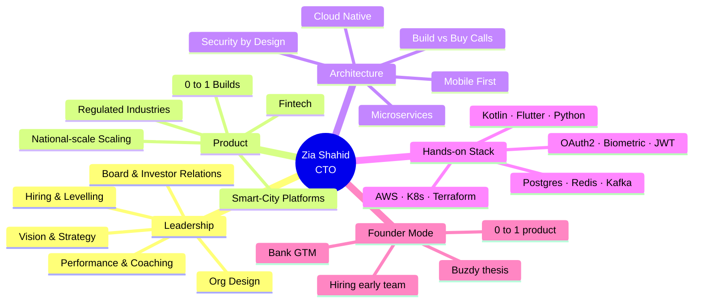
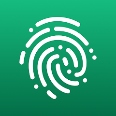
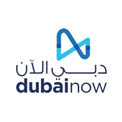
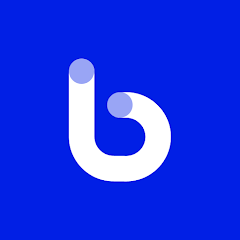
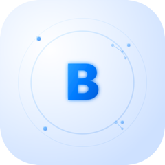
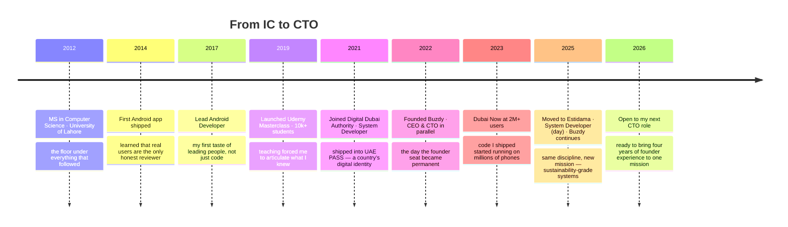
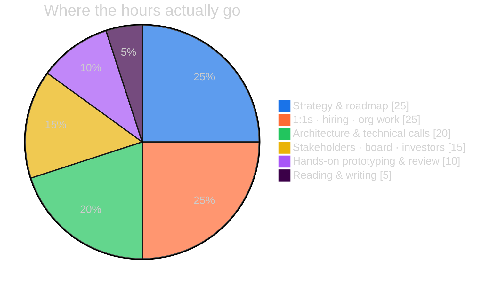
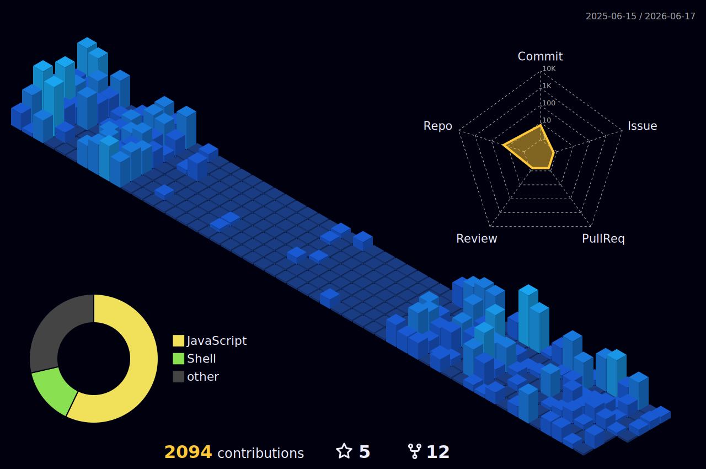

<!--
  ──────────────────────────────────────────────────────────────────
  You opened the source. Respect.
  This profile is positioned for one thing: hiring me as a CTO,
  not as a senior developer. Twelve years in, the technical work
  is the floor — leadership outcomes are the ceiling.
  If you're recruiting, advising, or investing — let's talk.
  — Zia
  ──────────────────────────────────────────────────────────────────
-->

<div align="center">



<br/>


<sub><a href="#-lets-talk">↓ Jump straight to contact</a></sub>

<a href="https://github.com/ziacto">
  
</a>

<br/>

[](https://www.linkedin.com/in/muhammadziashahid)
[](mailto:ziagaggoo@gmail.com?subject=Advisory%20enquiry)
[](mailto:ziagaggoo@gmail.com)
[](https://buzdy.com)

<br/>


</div>

<br/>

> _Most engineers write code._
> _Senior engineers write systems._
> _CTOs write the **decisions** that decide which systems exist at all._
>
> — _that's the seat I'm in._

---

## ◢ Hi, I'm Zia.

**Twelve years in. Two tracks. One continuous arc.**

For **four years** I was a **System Developer at Digital Dubai Authority** — shipping into **UAE PASS** (the country's national digital identity) and **Dubai Now** (the super-app 2M+ residents open daily). Today I'm a **System Developer at Estidama**, working on sustainability-grade systems for Abu Dhabi's built environment.

In parallel — **for those same four years** — I've been **Founder, CEO & CTO at Buzdy**. My own startup. My own product. My own team. My own thesis. That's where I built the CTO out of the engineer: strategy, hiring, fundraising, product, GTM.

Running a startup *while* shipping at national scale teaches you what most engineers never learn — how to lead, prioritize, and ship at **two stages at once**. I haven't been "preparing" for a CTO role. **I've been a CTO for four years already.** Now I'm **open to bringing that full conviction to one mission** — full-time, fractional, or board.

```yaml
identity:
  name:        Muhammad Zia Shahid
  callsign:    ziacto
  founder_at:  Buzdy · CEO & CTO since 2022   (live product, real users)
  day_job:     System Developer @ Estidama   (previously: Digital Dubai Authority)
  city:        Dubai, UAE
in_one_line:   I've been a CTO for four years — at my own startup, while shipping at national scale.
operating:     Strategy · Org design · Hiring · Architecture · Hands-on
status:        Open to next CTO role (full-time / fractional / board)
```

---

## ◢ What I Do as CTO

<table>
<tr>
<td width="33%" valign="top" align="center">

###  🧭
#### **Set Technical Direction**

Translate business strategy into a roadmap engineers can ship — and stakeholders can fund.

</td>
<td width="33%" valign="top" align="center">

###  👥
#### **Design the Organisation**

Build the team that builds the product. Hiring, levelling, comp, on-call, performance — the whole machine.

</td>
<td width="33%" valign="top" align="center">

###  🏗️
#### **Own the Architecture**

Make the calls only the CTO can make: build vs buy, monolith vs micro, cloud vs on-prem, regulated vs fast.

</td>
</tr>
<tr>
<td width="33%" valign="top" align="center">

###  🛡️
#### **Manage Risk**

Security, compliance, uptime, data, vendor lock-in, key-person risk. The chief de-risker.

</td>
<td width="33%" valign="top" align="center">

###  🗣️
#### **Represent Engineering**

To the board. To investors. To regulators. To the rest of the org. Engineering's voice in every room.

</td>
<td width="33%" valign="top" align="center">

###  ⚒️
#### **Stay Hands-On When It Matters**

Prototype the new thing. Debug the worst incident. Review the highest-risk PR. Lead from the front.

</td>
</tr>
</table>

---

## ◢ The Mind Map



---

## ◢ Products I've Led

<table>
<tr>
<td width="33%" align="center" valign="top">

<br/>


### `UAE_PASS`
**A country's digital identity**

🏛️ &nbsp; 50+ government services
🔐 &nbsp; End-to-end encryption
👤 &nbsp; Biometric MFA

> _Role: **System Developer @ DDA**_
> _Scope: **national**_

<br/>

</td>
<td width="33%" align="center" valign="top">

<br/>


### `DUBAI_NOW`
**The city in your pocket**

📱 &nbsp; 2M+ active users
💳 &nbsp; High-volume payments
⚡ &nbsp; Major reliability uplift

> _Role: **System Developer @ DDA**_
> _Scope: **city-wide**_

<br/>

</td>
<td width="33%" align="center" valign="top">

<br/>


### `BOTIM`
**Calls, chat, money — one app**

📥 &nbsp; 100M+ downloads (product)
🎙️ &nbsp; HD voice & video
🌐 &nbsp; AI real-time translation

> _Role: **contributor**_
> _Scope: **global**_

<br/>

</td>
</tr>
</table>

---

## ◢ Founder's Lens — `BUZDY`

<div align="center">

> _The clearest signal a CTO can offer is this: I've sat in the founder's seat too._
> _I know what your CEO needs from me, because I've been the CEO too._

<br/>



### **A lead engine for banks — built from zero by me.**

[](https://play.google.com/store/apps/details?id=com.buzdy.zia)

<sub>_live · iterating · hiring quietly_</sub>

</div>

<br/>

<table>
<tr>
<td width="50%" valign="top">

#### 🎯 The Problem
Banks burn millions chasing leads that convert at single-digit rates. Most "fintech leads" are noise dressed as signal.

</td>
<td width="50%" valign="top">

#### 💡 The Bet
A consumer product delivering real-time crypto signals, bank intelligence, and AI-driven coin analysis — that **self-qualifies users** as high-intent leads in the process.

</td>
</tr>
</table>

```diff
+ Founder & CTO    — thesis, product, team, GTM
+ Stack            — Android · Flutter · Python · AI · AWS
+ Status           — Live on Google Play · iterating fast
+ Looking for      — design partners (banks, fintechs) · advisors
```

> **Why it matters for hiring me:** I've owned the CTO seat at every stage — government-scale (UAE PASS), city-scale (Dubai Now), and 0 → 1 (Buzdy). I know what each stage needs from its CTO — and it's not the same answer.

---

## ◢ Twelve Years in Motion



---

## ◢ How a CTO Spends a Week



---

## ◢ How I Operate

<table>
<tr>
<td width="50%" valign="top">

<details open>
<summary><b>🧭 Operating Principles</b></summary>
<br/>

- **The CTO's job is to make irreversible decisions reversible.** Optionality is a deliverable.
- **Hire slow, fire kind, level honestly.** Most engineering pain is org pain wearing a tech mask.
- **Boring tech, bold outcomes.** Postgres still wins.
- **Security is a product feature, not a phase.**
- **Mentorship multiplies output more than any framework choice.**
- **Read the docs. All of them. Yes, the changelog too.**

</details>

<details>
<summary><b>⚡ My decision framework</b></summary>
<br/>

For any technical call I sequence three questions:

1. **Is it safe?** (security, privacy, uptime, compliance)
2. **Is it kind?** (UX, error states, accessibility, on-call sanity)
3. **Is it fast?** (perf, dev velocity, time-to-feedback)

If a "yes" to (3) requires a "no" to (1) or (2) — it's a no, regardless of deadline pressure.

</details>

<details>
<summary><b>🧠 How I hire</b></summary>
<br/>

- **Slope, not intercept.** A junior who shipped weekly beats a senior who's been "ramping" for six months.
- **Strong opinions, loosely held.** Strong opinions tightly held are a culture tax.
- **Self-management is the level-up.** I don't promote IC excellence to manage other ICs unless they want it.
- **Comp is a strategy lever, not an HR formality.**

</details>

</td>
<td width="50%" valign="top">

<details open>
<summary><b>🎯 What I'm Open To</b></summary>
<br/>

- **Full-time CTO** at a Series A → Series C product company
- **Fractional CTO** (1–2 days/week, 6–12 month engagements)
- **Board / Advisory** seats — engineering, product, security
- **Founding CTO** roles where I can build the engineering DNA from week one
- Pre-conditions: real users, real stakes, mission I can defend

</details>

<details>
<summary><b>🔬 Currently in the Lab</b></summary>
<br/>

- 🧪 Compose Multiplatform — one codebase, every screen
- 🤖 LLM agents inside engineering workflows
- 📡 Edge ML for IoT pipelines
- 🔐 Zero-knowledge auth flows
- 📚 Writing — short essays on engineering leadership
- 🎙️ Open to podcast invites & executive forums

</details>

<details>
<summary><b>🚫 Not interested in</b></summary>
<br/>

- Pre-revenue with no thesis
- "CTO" titles that are actually tech-lead roles
- Crypto-token launches
- Hype cycles dressed as strategy

</details>

</td>
</tr>
</table>

---

## ◢ Mission Control

<div align="center">


<br/>


<br/><br/>


<br/><br/>

<details>
<summary><b>🌐 3D Contribution Cube · click to expand</b></summary>
<br/>

<sub><i>Auto-generated daily via GitHub Actions</i></sub>
</details>

<details>
<summary><b>📊 Full Metrics Dashboard · click to expand</b></summary>
<br/>

<sub><i>Auto-generated daily via lowlighter/metrics</i></sub>
</details>

<details>
<summary><b>🐍 Snake Contribution Animation · click to expand</b></summary>
<br/>

</details>

</div>

---

## ◢ The Workshop · hands-on stack

<details>
<summary><b>📱 Mobile · where I'm at home</b></summary>
<br/>


</details>

<details>
<summary><b>🐍 Backend & Data · where the truth lives</b></summary>
<br/>


</details>

<details>
<summary><b>☁️ Cloud & DevOps · where it stays up</b></summary>
<br/>


</details>

<details>
<summary><b>🛡️ Security · where I refuse to compromise</b></summary>
<br/>


</details>

---

## ◢ Credentials & Receipts

<table>
<tr>
<td width="33%" align="center" valign="top">

### 🎓
#### **Education**

**MS Computer Science**
_Software Engineering_

University of Lahore
Class of 2012

</td>
<td width="33%" align="center" valign="top">

### 📜
#### **Certifications**

Google Certified Android
Flutter Certified Developer
AWS Solutions Architect
Certified Ethical Hacker (CEH)

</td>
<td width="33%" align="center" valign="top">

### 🏆
#### **At-Scale Receipts**

National-scale auth shipped
Smart-city super-app at 2M+ users
10,000+ developers mentored
Founder of a live product

</td>
</tr>
</table>

---

<div align="center">

## ◢ Let's Talk

I read every message. I reply to the serious ones.
If you're **hiring a CTO**, looking for a **fractional**, building a **board**, or running a **problem worth a decade** — I'd like to hear about it.

<br/>

<p>
  <a href="https://www.linkedin.com/in/muhammadziashahid"></a>
  &nbsp;
  <a href="mailto:ziagaggoo@gmail.com"></a>
  &nbsp;
  <a href="https://github.com/ziacto"></a>
  &nbsp;
  <a href="https://www.udemy.com/course/full-stack-mobile-application-development-master-class/"></a>
  &nbsp;
  <a href="https://buzdy.com"></a>
</p>

<sub>
  <b>LinkedIn</b> · preferred for hiring &nbsp;|&nbsp;
  <b>Email</b> · direct + private &nbsp;|&nbsp;
  <b>GitHub</b> · where my work lives &nbsp;|&nbsp;
  <b>Udemy</b> · 10k+ students &nbsp;|&nbsp;
  <b>Buzdy</b> · what I'm building
</sub>

<br/>

> _You scrolled the whole thing._
> _That's the kind of attention I hire for — and the kind I bring._
>
> **— Zia**

<br/>


<sub>_Crafted by hand · maintained with care · last polish 2026_</sub>

</div>

<!--
  ──────────────────────────────────────────────────────────────────
  Still reading? You may be my next hire — or my next employer.
  Either way: ziagaggoo@gmail.com.
  ──────────────────────────────────────────────────────────────────
-->
