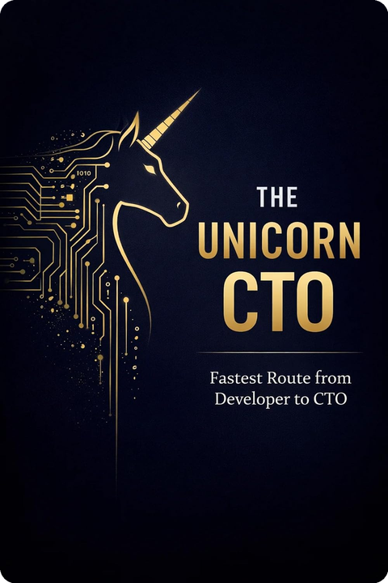
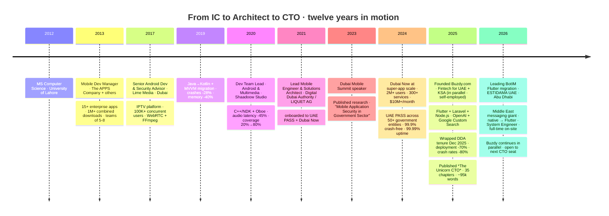

<!--
  Zia Shahid — GitHub Profile README
  Positioning: Senior Mobile Architect · Founder & CTO at Buzdy · Author
  Hand-crafted. Built to be read by founders, recruiters, investors, and serious engineers.
-->

<div align="center">


<br/>

# Muhammad Zia Shahid

### Senior Mobile Architect · Founder & CTO at Buzdy · Author of *The Unicorn CTO*

<sub>📍 &nbsp; **Dubai, UAE** &nbsp;·&nbsp; ⏳ &nbsp; **12+ years** &nbsp;·&nbsp; 🏛️ government &nbsp;·&nbsp; 💸 fintech &nbsp;·&nbsp; 🛡️ defense &nbsp;·&nbsp; 📡 telecom</sub>

<br/>

<table align="center">
<tr>
<td align="center" width="20%">

#### 👥 &nbsp; **2M+**
<sub>**DAILY USERS**<br/>on Dubai Now</sub>

</td>
<td align="center" width="20%">

#### 💸 &nbsp; **$10M+**
<sub>**MONTHLY TX**<br/>processed</sub>

</td>
<td align="center" width="20%">

#### ⚡ &nbsp; **99.99%**
<sub>**UPTIME**<br/>DDA microservices</sub>

</td>
<td align="center" width="20%">

#### 🧑‍💼 &nbsp; **20+**
<sub>**ENGINEERS LED**<br/>cross-functional team</sub>

</td>
<td align="center" width="20%">

#### 🎓 &nbsp; **100K+**
<sub>**UDEMY STUDENTS**<br/>taught</sub>

</td>
</tr>
</table>

<br/>

<a href="mailto:info@theappsfirm.com?subject=Intro%20call%20—%20from%20your%20GitHub"></a>

<sub>💼 _Talk to me about:_ &nbsp; **Fractional CTO · Head of Mobile · Founding CTO · Advisory** &nbsp;·&nbsp; <a href="#-lets-talk">other channels ↓</a></sub>

</div>

<br/>

> **I ship the mobile engineering machine behind ambitious products:**
> architecture, security, performance, hiring, delivery — and the hard calls in between.

---

## 🧭 Profile in One Page

| Area | Signal |
|---|---|
| **Current direction** | Open to **Fractional CTO · Head of Mobile · Founding CTO · Board / Advisory** |
| **Base** | Dubai, UAE &nbsp;·&nbsp; UTC+4 &nbsp;·&nbsp; open to remote / hybrid / on-site worldwide |
| **Background** | 12+ years shipping production mobile across **government, fintech, defense, and telecom** — apps reaching **3M+ users across products** |
| **Marquee work** | **Dubai Now** (2M+ users · $10M+/month) · **UAE PASS** (50+ government entities) · **BotIM** (current — Flutter migration) · **Ministry of Defense** · **Aldar Properties** · **Abu Dhabi TV** |
| **Leadership scope** | Led **20+ person cross-functional teams** (mobile · backend · DevOps · QA) at Digital Dubai Authority · mentored 15+ engineers, several promoted to senior |
| **Reliability bar** | **99.99% uptime** on DDA microservices · **99.9% crash-free** sessions on Dubai Now · **80% crash-rate reduction** · **70% faster deployments** |
| **Founder portfolio** | [Buzdy](https://buzdy.com) (fintech for UAE + KSA) · [TheAppsFirm](https://theappsfirm.com) · [W3Quran](https://w3quran.com) · [Mr Oye](https://mroye.com) · [Molaqat](https://molaqat.com) |
| **Author** | _The Unicorn CTO_ — 35 chapters · ~95k words · Dec 2025 |
| **Reach beyond product** | **100K+ Udemy students** · published research (2023) · Dubai Mobile Summit 2023 speaker |
| **Stack DNA** | Kotlin · Jetpack Compose · Flutter · KMM · Compose Multiplatform · Node.js · Laravel · Python · AWS · Kubernetes · own infra (Hetzner / Cloudflare) · AI-native (Claude Code / OpenAI CLI) |

---

## ✨ What Makes This Profile Different

> Most technical profiles show tools.
> This profile shows **judgment**.

I've worked across **three very different stages** of technology — most engineers see one or two.

<table>
<tr>
<td width="33%" valign="top">

### 🏛️ &nbsp; Government Scale

Shipped into **national and city-scale digital platforms** in the UAE ecosystem — including **military-grade systems** for the Ministry of Defense.

**Focus:** reliability, security, identity, regulated flows, production discipline.

</td>
<td width="33%" valign="top">

### 🚀 &nbsp; Founder Scale

Built and operated **multiple ventures from idea to live product** — fintech, AI tooling, Islamic tech, productivity.

**Focus:** speed, GTM, hiring, infrastructure, product-market learning.

</td>
<td width="33%" valign="top">

### 🧠 &nbsp; Architect Scale

Turned **technical decisions into business outcomes** across 12 years.

**Focus:** mobile architecture, microservices, security, AI integration, team design, board-level communication.

</td>
</tr>
</table>

---

## 🧩 What I Do as a CTO / Mobile Architect

<table>
<tr>
<td width="50%" valign="top">

### 01 · Technical Direction

I translate messy business goals into technical priorities engineers can actually ship.

- Mobile architecture (Compose, Flutter, KMM)
- Build vs buy decisions
- Delivery sequencing
- Platform choices
- Technical debt strategy

</td>
<td width="50%" valign="top">

### 02 · Engineering Organisation

I build the team that builds the product.

- Hiring plans · role clarity · levelling
- Performance management
- Team rituals · delivery ownership
- On-call · incident review

</td>
</tr>
<tr>
<td width="50%" valign="top">

### 03 · Product + Execution

I stay close to the customer, not only the code.

- MVP definition · launch planning
- Reliability tradeoffs
- Product analytics
- Fast iteration loops

</td>
<td width="50%" valign="top">

### 04 · Risk + Trust

I treat security, uptime, and compliance as product features.

- Authentication · payments · data protection
- PKI · biometric · E2E encryption · DRM
- Vendor risk · incident response
- Stakeholder + board communication

</td>
</tr>
</table>

---

## 🏗️ Selected Systems & Products

<table>
<tr>
<td width="33%" align="center" valign="top">

<br/>


### UAE PASS

**National digital identity**

`PKI` · `biometric` · `OAuth2` · `E2E encrypted signing`

**50+ government entities** integrated.

_Role: **Lead Mobile Engineer & Solutions Architect**_
_Context: Digital Dubai Authority_

</td>
<td width="33%" align="center" valign="top">

<br/>


### Dubai Now

**UAE's flagship city super-app**

**2M+** active users<br/>
**300+** government services<br/>
**$10M+/month** in transactions<br/>
**99.9%** crash-free sessions

_Role: **Lead Mobile Engineer & Solutions Architect**_
_Context: Digital Dubai Authority_

</td>
<td width="33%" align="center" valign="top">

<br/>


### BotIM

**Middle East messaging giant**

`Flutter` · `WebSocket` · `VoIP` · `FCM` · `media`

Currently leading the **native-to-Flutter migration**.

_Role: **System Engineer** — leading Flutter migration_
_Context: Estidama UAE (current)_

</td>
</tr>
</table>

<table>
<tr>
<td width="50%" align="center" valign="top">

<br/>

### 🛡️ Ministry of Defense

**Military-grade mobile**

`PKI` · `custom encryption` · `biometric auth` · `secure offline sync`

_Role: Mobile Security Lead_
_Context: classified — public summary only_

</td>
<td width="50%" align="center" valign="top">

<br/>

### 📺 Abu Dhabi TV

**Streaming platform · 100K+ concurrent users**

`Nat Geo integration` · `adaptive bitrate` · `WebRTC` · `FFmpeg`

_Role: Senior Android & Security Advisor_
_Context: Lime Media IPTV_

</td>
</tr>
</table>

---

## 🧪 The Operator Portfolio

> _Founder-operated products in parallel with the day-job track — the agency funds the products, the products inform the book, the book opens the rooms._

| Venture | Category | What it proves |
|---|---|---|
| [**Buzdy**](https://buzdy.com) | Fintech · AI · UAE + KSA | I can build a product thesis, ship it end-to-end, and integrate AI into a real funnel |
| [**TheAppsFirm**](https://theappsfirm.com) | Apps agency | I understand client delivery, cashflow, and practical execution |
| [**W3Quran**](https://w3quran.com) | Islamic / Quran tech | I build beyond trends when the mission matters |
| [**Mr Oye**](https://mroye.com) | AI browser extension | I work AI-native and ship productivity tools |
| [**Molaqat**](https://molaqat.com) | Meetings / GCC productivity | I understand region-specific product opportunities |

<br/>

### 💸 &nbsp; Founder's bet — Buzdy in depth

<table>
<tr>
<td width="25%" align="center" valign="middle">


</td>
<td width="75%" valign="top">

**A fintech platform for UAE and KSA** — credit card comparisons + banking analytics, with OpenAI for AI-powered content extraction and Google Custom Search for automated deal discovery across bank websites.

```diff
+ Stack         Flutter · Laravel · Node.js · TypeScript · GraphQL · WebSocket · OpenAI API · Firebase · MySQL
+ Footprint     iOS · Android · Web
+ Started       Jan 2025 — Self-employed in parallel with day job
+ Status        Live · iterating · UAE banking partnerships in motion
+ Looking for   design partners (banks, fintechs) · advisors
```

<p>
  <a href="https://apps.apple.com/il/app/buzdy/id6758299754"></a>
  &nbsp;
  <a href="https://play.google.com/store/apps/details?id=com.buzdy.zia"></a>
  &nbsp;
  <a href="https://buzdy.com"></a>
</p>

</td>
</tr>
</table>

> _I do not only advise founders from the outside. I have sat in the founder seat, carried the delivery pressure, and made the uncomfortable calls._

---

## 🦄 The Unicorn CTO — I wrote the book

<div align="center">

<a href="https://www.amazon.com/Unicorn-CTO-Fastest-route-developer-ebook/dp/B0994S3TF8">
  
</a>

**35 chapters &nbsp;·&nbsp; ~95,000 words &nbsp;·&nbsp; published Dec 2025**

<p>
  <a href="https://www.amazon.com/Unicorn-CTO-Fastest-route-developer-ebook/dp/B0994S3TF8"></a>
  &nbsp;
  <a href="https://play.google.com/store/books?q=The+Unicorn+CTO+Zia+Shahid"></a>
  &nbsp;
  <a href="https://github.com/ziacto/unicorn-cto-daily"></a>
</p>

</div>

<br/>

> **A strong CTO is not a senior developer with a louder title.**
> A strong CTO protects the company from bad technical decisions, bad hiring systems, bad incentives, and fake velocity.

**Inside:** the mindset shift that trips up 90% of new leaders · office politics · managing the 12 types of problem employees · budget & P&L ownership · building & scaling teams · staying technical while leading.

---

## 📍 Career Path



---

## 🧠 My Operating Manual

<details open>
<summary><b>Principles I actually use</b></summary>
<br/>

- **Boring technology, bold outcomes.** I prefer stable tools and aggressive execution.
- **Architecture is a business decision.** Every technical choice creates cost, speed, risk, or leverage.
- **Security is not a checklist.** It is part of the product experience.
- **A team without ownership becomes a ticket factory.**
- **The best CTO is close enough to code to know reality, and far enough from code to see the business.**

</details>

<details>
<summary><b>How I make technical decisions</b></summary>
<br/>

For every major technical call, I ask:

1. **Is it safe?** Security, privacy, uptime, compliance.
2. **Is it kind?** UX, error states, support load, on-call sanity.
3. **Is it fast?** Delivery speed, feedback loop, performance.

If speed requires breaking safety or kindness, it's the wrong speed.

</details>

<details>
<summary><b>How I think about hiring</b></summary>
<br/>

- **Hire for slope, not only current level.**
- **Promote ownership, not noise.**
- **Don't confuse confidence with competence.**
- **Give clear standards before judging performance.**
- **Protect strong engineers from broken process.**

</details>

<details>
<summary><b>What I'm currently exploring</b></summary>
<br/>

- Compose Multiplatform in production
- LLM agents inside engineering workflows
- Edge ML for IoT pipelines
- Zero-knowledge auth flows
- Public-sector tech for the GCC

</details>

---

## 🛠️ Technical Stack

<details open>
<summary><b>📱 &nbsp; Mobile · where I architect</b></summary>
<br/>


</details>

<details>
<summary><b>🐍 &nbsp; Backend, APIs & data</b></summary>
<br/>


</details>

<details>
<summary><b>🏗️ &nbsp; Infrastructure I run myself · no SRE between me and the box</b></summary>
<br/>


</details>

<details>
<summary><b>🛡️ &nbsp; Security · where I refuse to compromise</b></summary>
<br/>


</details>

<details>
<summary><b>🎬 &nbsp; Media & Real-time · streaming, codecs, low-latency</b></summary>
<br/>


<sub>_Powered Lime Media IPTV — 100K+ concurrent users._</sub>

</details>

<details>
<summary><b>🤖 &nbsp; AI-native workflow · how I move faster</b></summary>
<br/>


</details>

---

## 📊 GitHub Mission Control

<div align="center">


<details>
<summary><b>🌐 &nbsp; 3D Contribution Cube</b></summary>
<br/>

</details>

<details>
<summary><b>📊 &nbsp; Full Metrics Dashboard</b></summary>
<br/>

</details>

<details>
<summary><b>🐍 &nbsp; Snake Contribution Animation</b></summary>
<br/>

</details>

</div>

<sub>_Most of my best code lives in client and venture private repos — the public green is my open thinking._</sub>

---

## 🧾 Credentials, Speaking & Publications

<table>
<tr>
<td width="25%" align="center" valign="top">

### 🎓 &nbsp; Education

**MS Computer Science**<br/>
_Software Engineering_

University of Lahore

</td>
<td width="25%" align="center" valign="top">

### 📜 &nbsp; Certifications

AWS Solutions Architect<br/>
Certified Kubernetes Administrator (CKA)<br/>
Google Certified Android Developer<br/>
Flutter Certified Developer<br/>
Certified Ethical Hacker (CEH)<br/>
OWASP Mobile Security Specialist

</td>
<td width="25%" align="center" valign="top">

### 🎙️ &nbsp; Speaking & Writing

**Dubai Mobile Summit** &nbsp;·&nbsp; 2023 Speaker<br/><br/>
Published research:<br/>
_Mobile Application Security in the Government Sector_ &nbsp;·&nbsp; 2023<br/><br/>
Book: _The Unicorn CTO_ &nbsp;·&nbsp; 2025

</td>
<td width="25%" align="center" valign="top">

### 🏆 &nbsp; Signals

3M+ users (career total)<br/>
$10M+/month processed<br/>
20+ engineers led · 15+ mentored<br/>
99.99% uptime · 99.9% crash-free<br/>
100K+ Udemy students<br/>
5 live ventures founded

</td>
</tr>
</table>

---

## 🎯 Roles I'm Open To

<table>
<tr>
<td width="33%" valign="top">

### 💼 &nbsp; Full-time tracks

- **Head of Mobile Engineering** at growth-stage product companies
- **Senior EM · Director of Mobile** (15–25 engineer scope)
- **Founding CTO** at mobile-first, regulated-industry startups

</td>
<td width="33%" valign="top">

### ⚡ &nbsp; Fractional & strategic

- **Fractional CTO** for fintech · govtech · healthtech
- **Architect-in-Residence** scaling 5 → 20 mobile engineers
- **Mobile architecture audits** · security-first system design

</td>
<td width="33%" valign="top">

### 🎓 &nbsp; Board & advisory

- **Engineering · product · security advisory** at seed → Series B
- **Independent board seats** for mobile-first / regulated products
- **Strategic technical reviews** before raises or audits

</td>
</tr>
</table>

> **Best-fit company profile** &nbsp;·&nbsp; Series A → Series C &nbsp;·&nbsp; 5–50 engineers &nbsp;·&nbsp; regulated industry (fintech, govtech, healthtech, identity) &nbsp;·&nbsp; mobile-heavy or going mobile-first &nbsp;·&nbsp; GCC · EU · or globally-remote with 4+ hour Dubai overlap.

---

<div id="-lets-talk"></div>

## 🤝 Let's Talk

<div align="center">

I'm most interested in **serious technical leadership conversations**:
Fractional CTO · Head of Mobile · Founding CTO · advisory seats · ambitious products with real users.

<br/>

<p>
  <a href="https://www.linkedin.com/in/muhammadziashahid"></a>
  &nbsp;
  <a href="mailto:info@theappsfirm.com"></a>
  &nbsp;
  <a href="https://github.com/ziacto"></a>
  &nbsp;
  <a href="https://www.udemy.com/course/full-stack-mobile-application-development-master-class/"></a>
</p>

> **Best channel for hiring →** LinkedIn
> **Best channel for private conversations →** Email

</div>

---

<div align="center">

<sub>_Built by hand · updated for clarity · designed to be read by founders, recruiters, investors, and serious engineers._</sub>

</div>

<!--
  You scrolled the whole thing. That's the kind of attention I respect.
  Reach out: info@theappsfirm.com
-->
