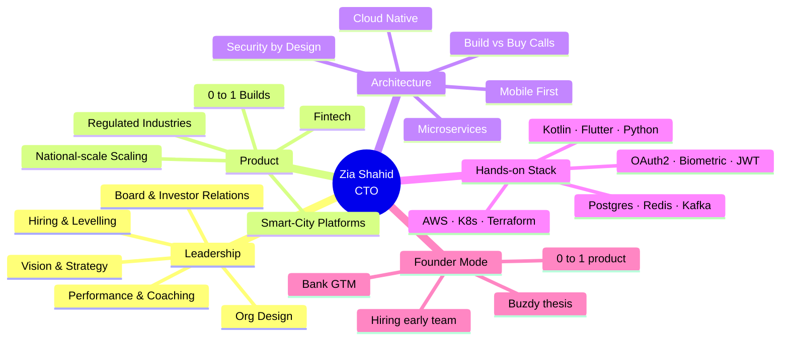
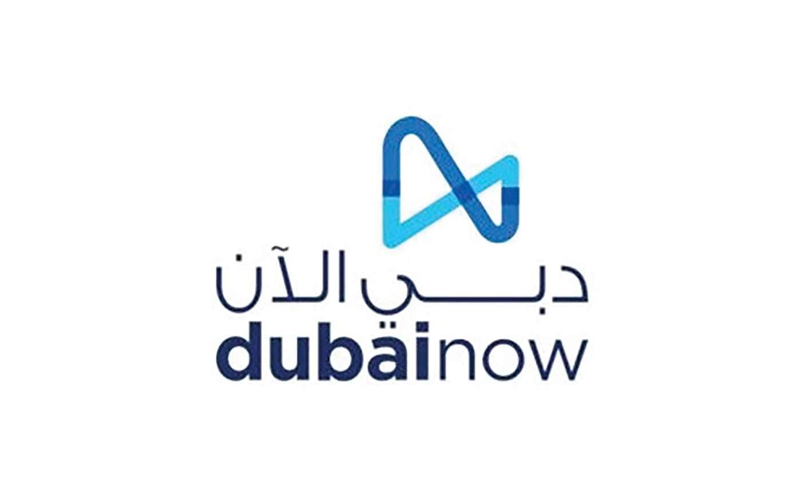
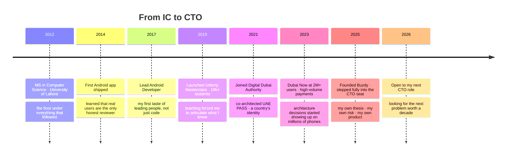
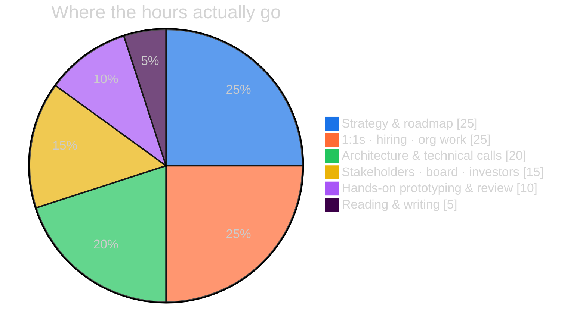

<!--
  ──────────────────────────────────────────────────────────────────
  You opened the source. Respect.
  This profile is positioned for one thing: hiring me as a CTO,
  not as a senior developer. Twelve years in, the technical work
  is the floor — leadership outcomes are the ceiling.
  If you're recruiting, advising, or investing — let's talk.
  — Zia
  ──────────────────────────────────────────────────────────────────
-->

<div align="center">


<br/>

```ansi
> boot.profile --identity zia --role cto
[ ok ] 12 years of engineering memory loaded
[ ok ] national-scale systems online
[ ok ] founder mode: active
[ ok ] one visitor — welcome.
```

<a href="https://github.com/ziacto">
  
</a>

<br/>

[](https://www.linkedin.com/in/muhammadziashahid)
[](mailto:ziagaggoo@gmail.com?subject=Advisory%20enquiry)
[](mailto:ziagaggoo@gmail.com)
[](https://buzdy.com)

<br/>


</div>

<br/>

> _Most engineers write code._
> _Senior engineers write systems._
> _CTOs write the **decisions** that decide which systems exist at all._
>
> — _that's the seat I'm in._

---

## ◢ Hi, I'm Zia.

**Twelve years in.** Started as an Android developer. Grew into a Mobile Architect. Stepped into engineering leadership at **Digital Dubai Authority**, where I co-architected **UAE PASS** — a country's digital identity — and lead mobile on **Dubai Now**, the super-app that's quietly woven into 2M+ daily lives across the UAE.

Now I'm **CTO at Buzdy** — my own founder bet — and **open to my next CTO role** (or fractional / board seat).

I've done the technical work. Kotlin, Flutter, Python, AWS — yes, I can still draw the architecture on a whiteboard *and* commit the prototype the same afternoon. But the work I'm hired for now isn't code. It's **the call before the code is written**: which problem, which team, which stack, which risk, which trade-off. That's the seat I want to sit in for the next decade.

```yaml
identity:
  name:        Muhammad Zia Shahid
  callsign:    ziacto
  role:        CTO @ Buzdy.com   ·   open to next CTO / fractional role
  also:        Lead Mobile Architect @ Digital Dubai Authority
  city:        Dubai, UAE
in_one_line:   Engineering leader who has shipped products to entire countries.
operating:     Strategy · Org design · Hiring · Architecture · Hands-on when needed
not_a_fit_if:  no real users, no real stakes, no real ambition
```

---

## ◢ What I Do as CTO

<table>
<tr>
<td width="50%" valign="top">

### **Set technical direction**
Translate business strategy into a roadmap engineers can actually ship — and stakeholders can actually fund.

### **Design organisations**
Build the team that builds the product. Hiring, levelling, comp, on-call, performance — the whole machine.

### **Own the architecture**
Make the calls only the CTO can make: build vs buy, monolith vs micro, cloud vs on-prem, regulated vs fast.

</td>
<td width="50%" valign="top">

### **Manage risk**
Security, compliance, uptime, data, vendor lock-in, key-person risk. The CTO is the chief de-risker.

### **Represent engineering**
To the board. To investors. To regulators. To press. To the rest of the org. Engineering's voice in every room.

### **Stay hands-on when it matters**
Prototype the new thing. Debug the worst incident. Review the highest-risk PR. Lead from the front, not the rear.

</td>
</tr>
</table>

---

## ◢ The Mind Map



---

## ◢ Products I've Led

<table>
<tr>
<td width="33%" align="center" valign="top">


### `UAE_PASS`
**A country's digital identity**

50+ government services
End-to-end encryption
Biometric MFA

> _Role: co-architect_
> _Scope: national_

</td>
<td width="33%" align="center" valign="top">



### `DUBAI_NOW`
**The city in your pocket**

2M+ active users
High-volume payments
Major reliability uplift

> _Role: mobile lead_
> _Scope: city-wide_

</td>
<td width="33%" align="center" valign="top">


### `BOTIM`
**Calls, chat, money — one app**

100M+ downloads (product)
HD voice & video
AI real-time translation

> _Role: mobile architect_
> _Scope: global_

</td>
</tr>
</table>

---

## ◢ Founder's Lens — `BUZDY`

> _The clearest signal a CTO can offer is this: I've sat in the founder's seat too._
> _I know what your CEO needs from me, because I've been the CEO too._

<table>
<tr>
<td width="22%" align="center" valign="middle">


<br/>

[](https://play.google.com/store/apps/details?id=com.buzdy.zia)

</td>
<td width="78%" valign="top">

### **A lead engine for banks — built from zero by me.**

I watched banks burn millions on lead funnels that converted at single-digit rates. Buzdy is my answer: a consumer product that delivers **real-time crypto signals, bank intelligence, and AI-driven coin analysis** — and quietly **self-qualifies users** as high-intent leads in the process.

```diff
+ Founder & CTO    — thesis, product, team, GTM
+ Stack            — Android · Flutter · Python · AI · AWS
+ Status           — Live on Google Play · iterating fast
+ Looking for      — design partners (banks, fintechs) · advisors
```

**Why it matters for hiring me:** I've owned the CTO seat at every stage. Government-scale (UAE PASS). City-scale (Dubai Now). 0 → 1 (Buzdy). I know what each stage needs from its CTO — and it's not the same answer.

</td>
</tr>
</table>

---

## ◢ Twelve Years in Motion



---

## ◢ How a CTO Spends a Week



---

## ◢ How I Operate

<table>
<tr>
<td width="50%" valign="top">

<details open>
<summary><b>🧭 Operating Principles</b></summary>
<br/>

- **The CTO's job is to make irreversible decisions reversible.** Optionality is a deliverable.
- **Hire slow, fire kind, level honestly.** Most engineering pain is org pain wearing a tech mask.
- **Boring tech, bold outcomes.** Postgres still wins.
- **Security is a product feature, not a phase.**
- **Mentorship multiplies output more than any framework choice.**
- **Read the docs. All of them. Yes, the changelog too.**

</details>

<details>
<summary><b>⚡ My decision framework</b></summary>
<br/>

For any technical call I sequence three questions:

1. **Is it safe?** (security, privacy, uptime, compliance)
2. **Is it kind?** (UX, error states, accessibility, on-call sanity)
3. **Is it fast?** (perf, dev velocity, time-to-feedback)

If a "yes" to (3) requires a "no" to (1) or (2) — it's a no, regardless of deadline pressure.

</details>

<details>
<summary><b>🧠 How I hire</b></summary>
<br/>

- **Slope, not intercept.** A junior who shipped weekly beats a senior who's been "ramping" for six months.
- **Strong opinions, loosely held.** Strong opinions tightly held are a culture tax.
- **Self-management is the level-up.** I don't promote IC excellence to manage other ICs unless they want it.
- **Comp is a strategy lever, not an HR formality.**

</details>

</td>
<td width="50%" valign="top">

<details open>
<summary><b>🎯 What I'm Open To</b></summary>
<br/>

- **Full-time CTO** at a Series A → Series C product company
- **Fractional CTO** (1–2 days/week, 6–12 month engagements)
- **Board / Advisory** seats — engineering, product, security
- **Founding CTO** roles where I can build the engineering DNA from week one
- Pre-conditions: real users, real stakes, mission I can defend

</details>

<details>
<summary><b>🔬 Currently in the Lab</b></summary>
<br/>

- 🧪 Compose Multiplatform — one codebase, every screen
- 🤖 LLM agents inside engineering workflows
- 📡 Edge ML for IoT pipelines
- 🔐 Zero-knowledge auth flows
- 📚 Writing — short essays on engineering leadership
- 🎙️ Open to podcast invites & executive forums

</details>

<details>
<summary><b>🚫 Not interested in</b></summary>
<br/>

- Pre-revenue with no thesis
- "CTO" titles that are actually tech-lead roles
- Crypto-token launches
- Hype cycles dressed as strategy

</details>

</td>
</tr>
</table>

---

## ◢ Mission Control

<div align="center">


<br/>


<br/><br/>


<br/><br/>

<details>
<summary><b>🌐 3D Contribution Cube · click to expand</b></summary>
<br/>

<sub><i>Auto-generated daily via GitHub Actions</i></sub>
</details>

<details>
<summary><b>📊 Full Metrics Dashboard · click to expand</b></summary>
<br/>

<sub><i>Auto-generated daily via lowlighter/metrics</i></sub>
</details>

<details>
<summary><b>🐍 Snake Contribution Animation · click to expand</b></summary>
<br/>

</details>

</div>

---

## ◢ The Workshop · hands-on stack

<details>
<summary><b>📱 Mobile · where I'm at home</b></summary>
<br/>


</details>

<details>
<summary><b>🐍 Backend & Data · where the truth lives</b></summary>
<br/>


</details>

<details>
<summary><b>☁️ Cloud & DevOps · where it stays up</b></summary>
<br/>


</details>

<details>
<summary><b>🛡️ Security · where I refuse to compromise</b></summary>
<br/>


</details>

---

## ◢ Credentials & Receipts

<div align="center">

| 🎓 **Education** | 📜 **Certifications** | 🏆 **At-scale work** |
|:---:|:---:|:---:|
| MS Computer Science | Google Certified Android Developer | National-scale auth shipped |
| _Software Engineering_ | Flutter Certified Developer | Smart-city super-app at 2M+ users |
| University of Lahore · 2012 | AWS Solutions Architect | 10,000+ developers mentored |
|  | Certified Ethical Hacker (CEH) | Founder of a live product |

</div>

---

<div align="center">

## ◢ Let's Talk

I read every message. I reply to the serious ones.

If you're hiring a CTO, looking for a fractional, building a board, or running an interesting problem — I'd like to hear about it.

<br/>

<a href="https://www.linkedin.com/in/muhammadziashahid">
  
</a>
<a href="mailto:ziagaggoo@gmail.com">
  
</a>
<a href="https://github.com/ziacto">
  
</a>
<a href="https://www.udemy.com/course/full-stack-mobile-application-development-master-class/">
  
</a>
<a href="https://buzdy.com">
  
</a>

<br/><br/>

```
              ╔════════════════════════════════════════════╗
              ║   You scrolled the whole thing.            ║
              ║   That's the kind of attention I hire for. ║
              ║                                            ║
              ║                                  — Zia     ║
              ╚════════════════════════════════════════════╝
```

<br/>


<sub>_Crafted by hand. Maintained with care._</sub>

</div>

<!--
  ──────────────────────────────────────────────────────────────────
  Still reading? You may be my next hire — or my next employer.
  Either way: ziagaggoo@gmail.com.
  ──────────────────────────────────────────────────────────────────
-->
